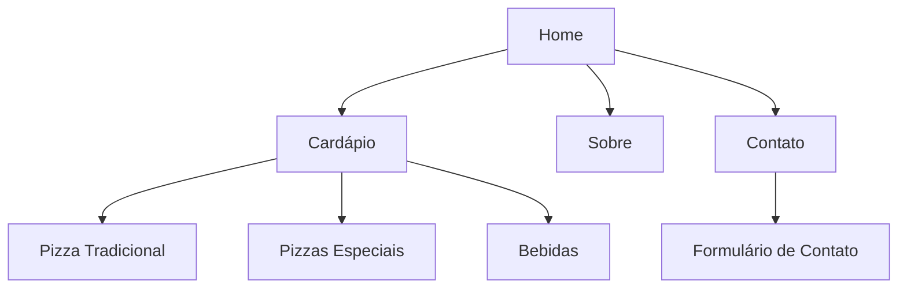

# 🚀 Aula 1 – Introdução ao Planejamento de Projetos Web

## 🎯 Objetivos da Aula

* Compreender o **fluxo de planejamento** de um site/sistema web.
* Explorar conceitos de **análise de mercado**, **público-alvo** e **briefing**.
* Entender o papel da **arquitetura da informação** no sucesso de um projeto.
* Iniciar o **primeiro exercício prático** de pesquisa e planejamento.

---

## 🧭 Por que planejar antes de programar?

Muitos iniciantes querem “ir direto pro código”. Mas sem planejamento, é como construir uma casa sem projeto de engenharia:

* 🏚️ Pode ficar instável.
* 💸 Vai gerar retrabalho e custos extras.
* ⏱️ Demora muito mais para ajustar depois.

> No desenvolvimento web, o **planejamento define os alicerces**: público, objetivo, requisitos e estrutura.

---

## 🧐 Etapas do Planejamento

### 1️⃣ **Análise de Mercado**

Antes de começar a programar, precisamos saber:

* Existe algo parecido no mercado?
* Qual diferencial vamos oferecer?
* Quem já é concorrente?

📌 Exemplo: Se vamos criar um site para delivery em uma cidade pequena, precisamos entender se já existe iFood/99Food atuando lá e se os restaurantes locais usam.

---

### 2️⃣ **Definição do Público-Alvo**

Público-alvo ≠ "todo mundo".
É quem realmente vai usar e se beneficiar do site.

📌 Exemplo:

* Site de cursos de programação → público pode ser **jovens de 16 a 30 anos**, interessados em tecnologia e carreira.

---

### 3️⃣ **Briefing (Levantamento de Informações)**

O briefing é um **documento inicial** com as informações básicas do projeto.
Perguntas comuns:

* Qual o objetivo do site?
* Quem é o público-alvo?
* Quais funcionalidades são essenciais?
* Quais são os concorrentes diretos?

📄 Exemplo de briefing resumido para um site de pizzaria:

* **Objetivo:** receber pedidos online.
* **Público-alvo:** moradores da cidade entre 18 e 40 anos.
* **Funcionalidades essenciais:** cardápio, pedidos, pagamentos.
* **Concorrentes:** iFood, pizzaria da esquina.

---

### 4️⃣ **Arquitetura da Informação**

Organizar como as páginas e conteúdos estarão estruturados.

📊 Exemplo em diagrama:

Esse fluxo mostra a **estrutura básica de navegação**.

---

## 💡 Estudo de Caso Rápido

Imagine que um **pequeno mercado local** quer vender online.

* **Análise de mercado:** já existe um supermercado grande com app próprio.
* **Público-alvo:** moradores do bairro que não querem ir até o centro.   

* **Briefing:**

  * Objetivo: facilitar compras rápidas de bairro.
  * Funcionalidades: catálogo simples, carrinho, retirada na loja.   

* **Arquitetura da informação:**

  * Home → Produtos → Categorias → Carrinho → Pagamento.

---

## 📝 Exercício Prático – Pesquisa e Planejamento

👉 Escolha um **negócio real da região** (pode ser uma pizzaria, mercado, salão de beleza, pet shop, academia, etc.).

### Tarefa:

1. Faça uma **análise de mercado**: quem são os concorrentes locais e online?
2. Defina o **público-alvo**: descreva idade, perfil e necessidades.
3. Monte um **mini-briefing** com no mínimo 4 perguntas respondidas (objetivo, funcionalidades, público, concorrentes).
4. Desenhe um **mapa simples de arquitetura da informação** (pode ser no papel, no Figma ou até usando uma ferramenta online como Miro ou Lucidchart).
