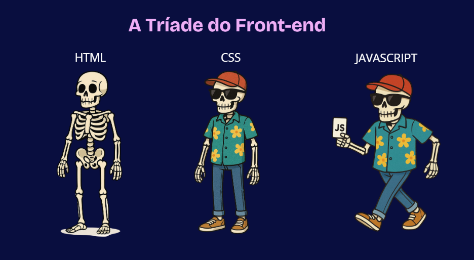

# 🎨 Aula 6 - Introdução ao Frontend

## O que é **Frontend**? 💻🎨

**Frontend** é a parte da programação web que envolve a criação da interface do usuário (UI). Quando você acessa um site, tudo o que você vê — como as cores, imagens, textos e botões — faz parte do **frontend**. Ele é feito principalmente com **HTML**, **CSS** (para estilizar) e **JavaScript** (para interatividade).

### Exemplo de Ferramentas de Frontend:

* **HTML:** Estrutura da página (o que você viu acima).
* **CSS:** Usado para estilizar a página (cores, fontes, layout).
* **JavaScript:** Adiciona interatividade (botões, animações).

<div align="center">
    
</div>


## 1. O que é HTML? 📝

`HTML` significa ***HyperText Markup Language*** (**Linguagem de Marcação de Hipertexto**). Ela é a base da **web** e é usada para estruturar o conteúdo das páginas. O HTML indica ao navegador como exibir textos, imagens, links e outros elementos.

### Exemplo de uso:

Quando você acessa um site, tudo o que aparece na página é resultado de um código HTML (junto com outras tecnologias, como CSS e JavaScript). O HTML não é uma linguagem de programação, mas sim de **marcação**, ou seja, ele organiza o conteúdo de forma estruturada.

---

## 2. Estrutura básica de uma página HTML 🏗️

### Exemplo de código:

```html
<!DOCTYPE html>
<html>
    <head>
        <title>Minha Primeira Página</title>
    </head>
    <body>
        <h1>Olá, Mundo!</h1>
        <p>Esta é a minha primeira página HTML.</p>
    </body>
</html>
```

* **`<!DOCTYPE html>`:** Informa ao navegador que estamos criando uma página HTML5.
* **`<html>`:** A tag raiz que envolve todo o conteúdo da página.
* **`<head>`:** Contém informações sobre a página, como o título (que aparece na aba do navegador) e links para arquivos externos, como CSS.
* **`<body>`:** Onde o conteúdo visível da página é colocado (textos, imagens, vídeos, etc.).

---

## 3. As principais tags do HTML 🔑

### Tag `<h1>` a `<h6>`: Títulos 🎯

Essas tags são usadas para criar títulos. O `<h1>` é o título mais importante (geralmente o maior), e o `<h6>` é o menos importante (geralmente o menor). Os títulos ajudam a organizar o conteúdo e são bons para SEO (Otimização para Motores de Busca).

* **Exemplo:**

```html
<h1>Este é um título principal</h1>
<h2>Este é um subtítulo</h2>
<h3>Subtítulo menor</h3>
```

### Tag `<p>`: Parágrafos 📜

A tag `<p>` é usada para definir parágrafos de texto.

* **Exemplo:**

```html
<p>Este é um parágrafo simples de texto.</p>
```

### Tag `<a>`: Links 🔗

A tag `<a>` cria links para outras páginas ou sites. O atributo `href` define o endereço de destino.

* **Exemplo:**

```html
<a href="https://www.google.com" target="_blank">Clique aqui para visitar o Google</a>
```

### Tag ``: Imagens 🖼️

A tag `` exibe imagens na página. O atributo `src` especifica o caminho da imagem, e `alt` é uma descrição alternativa para a imagem (útil para SEO e acessibilidade).

* **Exemplo:**

```html

```

### Tag `<ul>` e `<li>`: Listas Não Ordenadas 📝

Essas tags são usadas para criar listas com marcadores.

* **Exemplo:**

```html
<ul>
    <li>Item 1</li>
    <li>Item 2</li>
    <li>Item 3</li>
</ul>
```

### Tag `<ol>` e `<li>`: Listas Ordenadas 🔢

Essas tags são usadas para criar listas numeradas.

* **Exemplo:**

```html
<ol>
    <li>Primeiro</li>
    <li>Segundo</li>
    <li>Terceiro</li>
</ol>
```

---

## Exemplos Práticos 🛠️

### 1. Criar um Documento HTML Simples 💻

Vamos criar um arquivo HTML simples com um título e um parágrafo.

**Passo 1:** Crie um arquivo chamado `index.html`.

**Passo 2:** Adicione o seguinte código:

```html
<!DOCTYPE html>
<html>
    <head>
        <title>Minha Página Simples</title>
    </head>
    <body>
        <h1>Bem-vindos à minha página</h1>
        <p>Este é o meu primeiro parágrafo.</p>
    </body>
</html>
```

---

### 2. Adicionar uma Imagem e um Link 🌍

Agora vamos adicionar uma imagem e um link na nossa página.

**Exemplo:**

```html
<h2>Minha Foto Favorita</h2>


<p>Visite o <a href="https://www.google.com" target="_blank">Google</a> para mais informações.</p>
```

---

### 3. Criar uma Lista de Hobbies 🎮🎨📚

Vamos adicionar uma lista não ordenada com os seus hobbies ou coisas favoritas.

**Exemplo:**

```html
<h2>Meus Hobbies</h2>
<ul>
    <li>Ler</li>
    <li>Jogar videogame</li>
    <li>Desenhar</li>
</ul>
```

---

## Exercícios Finais 🚀

1. **Crie um segundo título** (usando `<h2>`) com uma breve descrição sua.
2. **Adicione duas imagens diferentes** na página e certifique-se de incluir uma descrição em texto (usando o atributo `alt`).
3. **Crie uma lista ordenada** dos três lugares que você gostaria de visitar no futuro.
