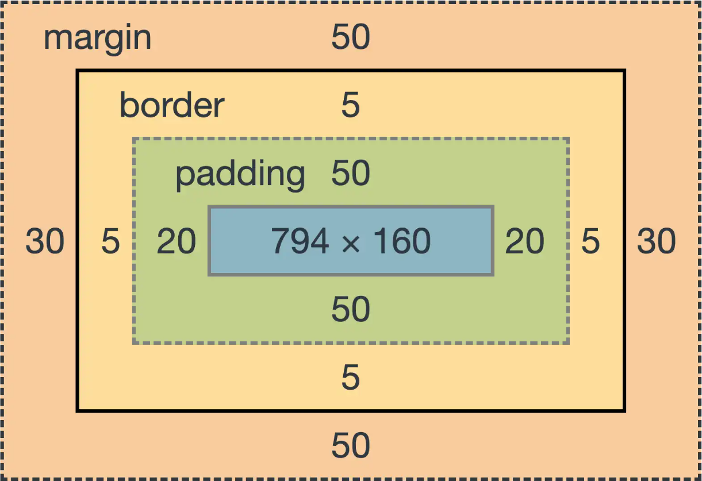

# 🧠 Aula 11 - Box Model e Propriedades de Layout 🧱

## 🎯 Objetivos da Aula

Ao final dessa aula, você será capaz de:

* Compreender o **Box Model** do CSS;
* Utilizar as propriedades `margin`, `padding`, `border` e `content`;
* Entender a diferença entre `display: block`, `inline` e `inline-block`;
* Manipular o **tamanho e espaçamento** dos elementos na página.

---

## O que é o Box Model?

Tudo no HTML é tratado como uma **caixa (box)** no CSS.
Cada elemento da página tem:

* **Content (conteúdo)** – onde fica o texto, imagem, etc.
* **Padding** – espaço **interno** entre o conteúdo e a borda.
* **Border** – a **borda** da caixa.
* **Margin** – espaço **externo**, que separa o elemento dos outros.

<div align="center">
    
    <p>Fonte: <em><a href="https://www.dio.me/articles/css-box-model" target="_blank">https://www.dio.me/articles/css-box-model</a></em></p>
</div>

---

## Exemplo prático do Box Model 🎨

```css
.caixa {
  width: 200px;
  height: 100px;
  background-color: lightblue;
  padding: 20px;
  border: 5px solid blue;
  margin: 15px;
}
```

💬 Aqui temos:

* **width/height:** tamanho do conteúdo
* **padding:** 20px de “respiro” interno
* **border:** linha de 5px azul
* **margin:** distância de 15px dos outros elementos

---

## Propriedades relacionadas ao tamanho 📏

| Propriedade               | O que faz                       | Exemplo                   |
| ------------------------- | ------------------------------- | ------------------------- |
| `width`                   | define a largura                | `width: 300px;`           |
| `height`                  | define a altura                 | `height: 200px;`          |
| `max-width` / `min-width` | limita tamanhos máximos/mínimos | `max-width: 800px;`       |
| `box-sizing`              | controla o cálculo do tamanho   | `box-sizing: border-box;` |

> [!TIP]
> Use `box-sizing: border-box;` para que o `padding` e a `border` **não aumentem** o tamanho total da caixa.

---

## Tipos de Display 🧩

A propriedade `display` define **como o elemento se comporta no layout** da página.

### 🔹 `display: block`

O elemento ocupa **toda a largura disponível** e **quebra linha** automaticamente.

📘 Exemplo:

```css
div {
  display: block;
}
```

🧱 Exemplos de elementos **block** por padrão:
`<div>`, `<p>`, `<h1>` a `<h6>`, `<section>`, `<article>`…

---

### 🔹 `display: inline`

O elemento **não quebra linha** e ocupa apenas o espaço do seu conteúdo.

📘 Exemplo:

```css
span {
  display: inline;
}
```

🧩 Exemplos de elementos **inline**:
`<span>`, `<a>`, `<strong>`, `<em>`…

---

### 🔹 `display: inline-block`

Combina o melhor dos dois mundos:

* Fica **na mesma linha**,
* Mas permite definir **largura, altura, margin e padding**.

📘 Exemplo:

```css
button {
  display: inline-block;
  padding: 10px 20px;
}
```

---

## 5️⃣ Diferença entre margin e padding 🧠

| Propriedade | Atua onde?                    | Exemplo visual                |
| ----------- | ----------------------------- | ----------------------------- |
| `margin`    | Espaço **fora** do elemento   | Separação entre caixas        |
| `padding`   | Espaço **dentro** do elemento | Espaço entre conteúdo e borda |

📘 Exemplo comparativo:

```css
.exemplo1 {
  background-color: coral;
  margin: 20px;
}

.exemplo2 {
  background-color: lightgreen;
  padding: 20px;
}
```

---

## 🧮 Lista de Exercícios

Crie uma pasta chamada `aula11_boxmodel` e dentro dela os arquivos `index.html` e `style.css`.

### 🧩 Exercício 1 — Estrutura básica

Crie uma página com um título principal e três caixas (`div`) identificadas como `caixa1`, `caixa2` e `caixa3`.

### 🧩 Exercício 2 — Trabalhando o Box Model

Aplique em cada caixa:

* Largura (`width`) e altura (`height`) diferentes;
* Cores de fundo distintas;
* `padding`, `margin` e `border` personalizados.

> [!TIP]
> Use `box-sizing: border-box` em uma das caixas para perceber a diferença no cálculo de tamanho.

---

### 🧩 Exercício 3 — Espaçamento e organização

Coloque as três caixas uma abaixo da outra e, depois, tente colocá-las **lado a lado** usando `display: inline-block`.

---

### 🧩 Exercício 4 — Comparando displays

Adicione três elementos diferentes:

* Um `<p>`,
* Um `<span>`,
* E um `<div>`

Teste mudar o `display` deles para:

* `block`,
* `inline`,
* e `inline-block`

Observe como o comportamento muda.

---

### 🧩 Exercício 5 — Criando um “cartão”

Monte um “card” simples de perfil:

```html
<div class="card">
  
  <h2>Seu Nome</h2>
  <p>Descrição curta...</p>
</div>
```

Aplique CSS para:

* Centralizar o conteúdo;
* Adicionar `padding`, `border-radius`, `box-shadow`;
* Definir uma largura fixa e margens automáticas.

---

### 🧩 Exercício 6 — Desafio bônus 💪

Crie uma **galeria de três imagens** lado a lado, com espaçamento entre elas, e usando `display: inline-block` e `box-sizing: border-box`.
Use bordas e padding diferentes para praticar o efeito visual de cada propriedade.
